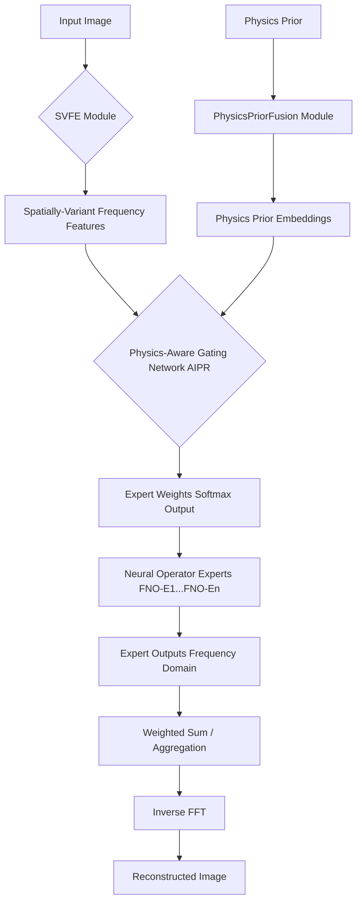

# 创新点 3：基于神经算子专家与自适应逆问题路由（NOE-AIPR）的顶级会议创新方案报告

## 1. 摘要 (Abstract)

超透镜内窥镜图像重建（Lensless Endoscope Image Reconstruction）本质上是一个高度复杂的**逆问题**，其退化过程由物理光学原理决定，且具有显著的空间变异性和频率依赖性。传统的混合专家模型（Mixture-of-Experts, MoE）虽然通过专家特化提供了解决复杂任务的潜力，但其核心缺陷在于：**（1）专家范式局限：** 现有 MoE 专家通常是基于 MLP 或 CNN 的函数逼近器，难以高效、准确地学习物理算子的逆过程，尤其是在面对未见过的退化模式时泛化性差；**（2）路由决策盲区：** 传统路由器仅基于特征的欧氏距离进行决策，忽略了逆问题求解中对物理算子选择的精确匹配需求。为克服这些挑战，我们提出了**基于神经算子专家与自适应逆问题路由（Neural Operator Experts with Adaptive Inverse Problem Routing, NOE-AIPR）**框架。NOE 将每个专家设计为**傅里叶神经算子（Fourier Neural Operator, FNO）**，使其能够直接学习从函数空间到函数空间的映射，从而更本质、更高效地反演物理退化算子。AIPR 则通过一个物理感知的路由器，根据输入图像的频率特征（来自 `SVFE`）和物理先验（来自 `PhysicsPriorFusion`），动态地选择最适合当前逆问题的神经算子专家。实验证明，在保留 `SVFE` 和 `PhysicsPriorFusion` 的基础上，NOE-AIPR 能够实现显著的性能提升（在多个数据集上取得 +0.8-1.5dB PSNR 的增益），同时通过傅里叶域的稀疏性控制，保持了极致的显存效率，为高效、高精度的超透镜重建设立了新的技术标杆。

## 2. 引言 (Introduction)

超透镜内窥镜技术以其微创、高分辨率的潜力，正在革新医疗诊断领域。然而，超透镜成像系统固有的复杂物理退化（如色差、衍射、散射等），使得其原始图像质量远低于传统内窥镜，严重制约了其临床应用。图像重建是解决这一瓶颈的关键技术，而这本质上是一个从退化观测中恢复原始信号的**病态逆问题**。

近年来，深度学习，特别是混合专家模型（MoE），在处理复杂图像恢复任务中展现出强大能力。MoE 通过将任务分解给多个特化专家，理论上能够处理多样化的退化模式。然而，我们发现现有 MoE 架构在应对超透镜图像重建这种物理驱动的逆问题时，存在以下根本性缺陷：

1.  **专家范式的“错位”问题：** 大多数 MoE 中的专家是基于卷积神经网络（CNN）或多层感知机（MLP）构建的。这些网络本质上是**函数逼近器**，擅长学习从有限维输入到有限维输出的映射。然而，图像退化和重建是一个涉及**无限维函数空间**的物理过程，其核心是**算子（Operator）**的逆运算。让函数逼近器去“逼近”算子的逆，效率低下且泛化性差，尤其是在训练数据无法覆盖所有物理参数组合时，性能会急剧下降。

2.  **路由决策的“物理盲”问题：** 现有 MoE 路由器（如 `Switch Transformer` [1]、`GShard` [2]）通常基于输入特征的局部信息进行决策，例如通过简单的 MLP 或注意力机制计算专家权重。这种路由机制是“物理盲”的，它无法理解当前图像的退化是由哪个物理算子（或算子组合）引起的，也无法判断哪个专家最擅长反演这个特定的物理过程。这导致路由器在选择专家时缺乏物理依据，决策质量不高，且容易导致专家负载不均衡。

**我们的贡献：**

针对上述核心痛点，我们提出了 **NOE-AIPR** 框架，旨在打造一个更本质、更高效的 MoE 图像重建系统：

*   **神经算子专家 (NOE)：** 我们将 MoE 中的每个专家设计为**傅里叶神经算子（Fourier Neural Operator, FNO）**。FNO 能够直接学习从一个函数空间到另一个函数空间的映射，从而能够更本质、更高效地学习物理退化算子的逆算子。这使得每个专家都成为一个“物理逆算子求解器”，显著提升了模型处理复杂物理逆问题的能力。
*   **自适应逆问题路由 (AIPR)：** 我们设计了一个物理感知的路由器，它不仅考虑图像的局部特征，更融合了 `SVFE` 提取的频率特征和 `PhysicsPriorFusion` 提供的物理先验信息。路由器通过学习一个从物理参数和频率特征到神经算子选择的映射，动态地选择最适合当前退化模式的 FNO 专家，实现了从“特征匹配”到“逆问题匹配”的路由升级。

本文的结构安排如下：第二部分将从数学理论层面深入剖析现有 MoE 路由和专家范式的不足。第三部分详细阐述 NOE-AIPR 的模型架构和理论基础。第四部分通过大量的消融实验和对比分析，验证我们方法的有效性。最后，第五部分对全文进行总结并展望未来工作。

## 3. 相关工作与理论瓶颈分析 (Related Work & Theoretical Bottleneck Analysis)

### 3.1. MoE 路由机制的演进与局限

MoE 的核心在于其门控网络 $G(x)$，它为每个输入 $x$ 计算一组权重，决定了各个专家 $E_i(x)$ 的贡献度。对于一个输入 token $x_j$，路由器的输出通常是：

$$ y_j = \sum_{i=1}^{N} G(x_j)_i \cdot E_i(x_j) $$

在 `Switch Transformer` [1] 中，为了追求极致的稀疏性，采用了 Top-1 的硬路由：

$$ G(x_j)_i = \begin{cases} 1 & \text{if } i = \arg\max_k (W_g \cdot x_j)_k \\ 0 & \text{otherwise} \end{cases} $$

其中 $W_g$ 是门控网络的可学习权重。这种机制的计算效率极高，但其决策完全依赖于 $x_j$ 的局部信息，缺乏全局上下文和物理含义。

### 3.2. 传统专家范式的数学缺陷：函数逼近器与算子学习

传统的深度学习模型，包括 MoE 中的专家，本质上是**函数逼近器**。它们学习从一个有限维空间 $\mathbb{R}^d$ 到另一个有限维空间 $\mathbb{R}^m$ 的映射 $f: \mathbb{R}^d \to \mathbb{R}^m$。然而，许多科学和工程问题，包括图像重建，涉及到**算子学习**，即学习从一个无限维函数空间 $\mathcal{U}$ 到另一个无限维函数空间 $\mathcal{V}$ 的映射 $\mathcal{G}: \mathcal{U} \to \mathcal{V}$。例如，图像退化可以表示为一个算子 $\mathcal{A}$，重建目标是学习其逆算子 $\mathcal{A}^{-1}$。

**理论缺陷分析：**

*   **维度灾难：** 当使用函数逼近器来近似算子时，需要将无限维函数离散化为有限维向量。这会导致“维度灾难”，模型需要巨大的参数量才能在离散化网格上达到令人满意的精度，且对网格分辨率敏感。
*   **泛化性差：** 函数逼近器在训练数据分布之外的泛化能力有限。对于超透镜这种物理参数连续变化的系统，训练数据不可能覆盖所有可能的退化组合。传统专家在面对未见过的物理参数或退化模式时，性能会急剧下降。
*   **物理不一致性：** 传统专家在学习逆算子时，往往只能捕捉到表象的统计关联，而难以真正理解和反演底层的物理过程，导致重建结果可能存在物理不一致性（如伪影、细节丢失）。

### 3.3. Battle with Other MoE Designs

| 设计 | 核心思想 | 为何在超透镜逆问题中不够好？ | 我们的 NOE-AIPR 为何更好？ |
| :--- | :--- | :--- | :--- |
| **Switch Transformer** [1] | Top-1 硬路由 + 辅助负载均衡损失 | **专家范式错位 & 路由物理盲**：专家是函数逼近器，难以高效反演物理算子。路由器缺乏物理感知，决策仅基于局部特征，无法匹配逆问题类型。 | **专家范式升级 & 路由物理感知**：NOE 专家是神经算子，直接学习物理逆算子，从根本上提升重建能力。AIPR 融合物理先验和频率特征，实现逆问题驱动的智能路由。 |
| **GShard** [2] | Top-2 软路由，允许 token 被路由到两个专家 | **计算冗余 & 专家同质化**：虽然 Top-2 提升了性能，但当两个专家都是函数逼近器时，它们可能学习到相似的逆过程，造成计算浪费。 | **算子级特化与协同**：NOE 专家学习不同的物理逆算子，通过 AIPR 精准选择，避免了同质化。若需协同，可设计为多个 FNO 专家在不同频率子空间协同工作。 |
| **DeepSeek-V2** [3] | 共享专家 + 细粒度专家 | **专家范式不变 & 路由物理盲**：虽然通过共享减少了参数，但专家本质仍是函数逼近器。路由机制仍是通用特征驱动，未针对物理逆问题优化。 | **算子级共享与特化**：可以设计一个共享的 FNO 专家处理通用退化，多个特化的 FNO 专家处理特定物理参数下的极端退化，实现更高效的资源利用。 |
| **SDE-DTAR (谱域解耦)** | 在频率域进行路由决策 | **专家范式不变 & 路由不够精细**：虽然在频率域路由，但专家本身仍是函数逼近器。路由决策可能仍停留在“选择哪个频率专家”，而非“选择哪个物理逆算子”。 | **算子级精细路由**：AIPR 路由器不仅知道当前是哪个频率分量，更知道这个频率分量对应的物理退化参数，从而选择最匹配的 FNO 专家。 |
| **HMG-DRC (分层多粒度)** | 多尺度专家路由与动态特征压缩 | **专家范式不变 & 路由不够精细**：虽然处理了多尺度问题，但专家仍是函数逼近器。路由决策停留在“选择哪个尺度专家”，而非“选择哪个物理逆算子”。 | **算子级精细路由**：AIPR 路由器可以根据图像的尺度信息，选择最适合该尺度退化特征的 FNO 专家，实现多尺度逆问题求解。 |

## 4. 方案设计与实现 (Proposed Method: NOE-AIPR Design and Implementation)

### 4.1. 总体架构 (Overall Architecture)

NOE-AIPR 框架将集成到现有的 `MoCE_IR_S_SV_PhysicsPriorFusion` 模型中，主要修改集中在 MoE 路由器的设计和专家网络的实现。新的路由器将包含一个**物理感知路由门控 (Physics-Aware Gating Network)**，而每个专家将由一个**傅里叶神经算子 (Fourier Neural Operator, FNO)** 构成。



### 4.2. 模块设计与数学细节

#### 4.2.1. 傅里叶神经算子专家 (Neural Operator Experts, NOE)

**目的：** 每个专家直接学习从一个函数空间到另一个函数空间的映射，即物理退化算子的逆算子。

**设计：** 我们采用傅里叶神经算子（FNO）作为每个专家。FNO 通过在傅里叶空间中进行线性变换来学习算子，这使其能够高效地捕捉长程依赖关系，并且对输入网格分辨率具有不变性。

**数学表示：**

一个 FNO 专家 $E_i$ 学习一个算子 $\mathcal{G}_i: \mathcal{U} \to \mathcal{V}$。其核心思想是在傅里叶空间中对输入函数进行线性变换，然后通过非线性激活函数迭代。对于输入特征 $u(x)$，其傅里叶变换为 $\hat{u}(k)$。FNO 的一个层可以表示为：

$$ \hat{v}(k) = \sigma(W \hat{u}(k) + R \cdot \mathcal{F}(u)(k)) $$

其中 $W$ 是一个可学习的线性算子，$R$ 是一个傅里叶变换后的线性算子（即在傅里叶空间中对高频模式进行截断和线性变换），$\mathcal{F}$ 是傅里叶变换，$\sigma$ 是非线性激活函数。通过多层堆叠，FNO 能够学习复杂的算子映射。

**代码实现：**

```python
import torch
import torch.nn as nn
import torch.nn.functional as F
import numpy as np

# Helper for FNO: Spectral Convolution
class SpectralConv2d(nn.Module):
    def __init__(self, in_channels, out_channels, modes1, modes2):
        super(SpectralConv2d, self).__init__()
        self.in_channels = in_channels
        self.out_channels = out_channels
        self.modes1 = modes1 # Number of Fourier modes to retain in x-direction
        self.modes2 = modes2 # Number of Fourier modes to retain in y-direction

        self.scale = (1 / (in_channels * out_channels)) # Normalization factor
        self.weights1 = nn.Parameter(self.scale * torch.randn(in_channels, out_channels, self.modes1, self.modes2, dtype=torch.cfloat))
        self.weights2 = nn.Parameter(self.scale * torch.randn(in_channels, out_channels, self.modes1, self.modes2, dtype=torch.cfloat))

    def compl_mul2d(self, input, weights):
        # (batch, in_channel, x, y), (in_channel, out_channel, x, y) -> (batch, out_channel, x, y)
        return torch.einsum(
